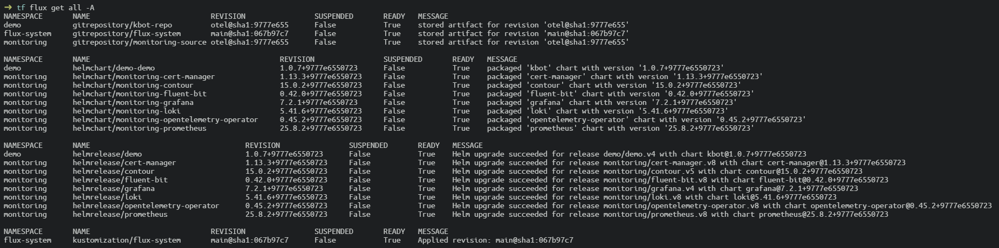
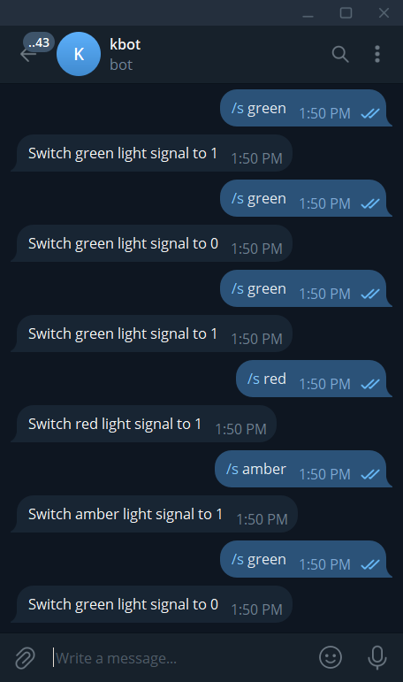
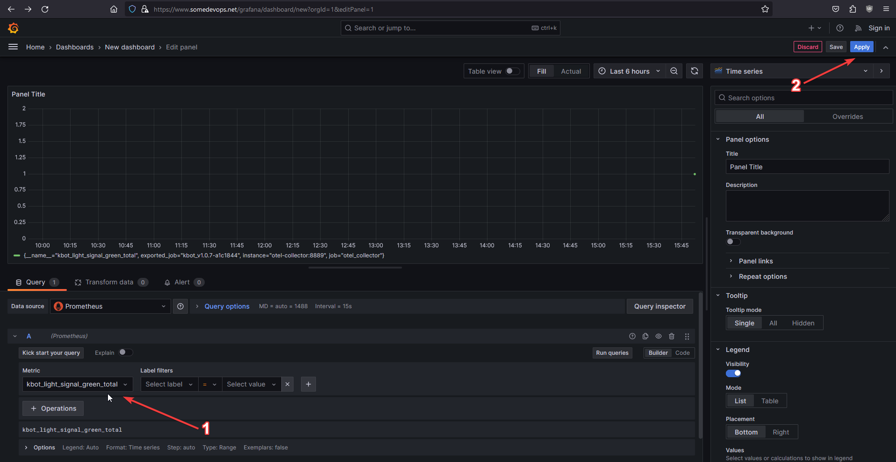

# Monitored Kbot Telegram bot in GKE with FluxCD

## Intro

This project represents the deployment of a monitoring stack of OTEL, Prometheus, Fluent-Bit, Grafana and Loki which is used to monitor the Kbot Telegram bot deployed in GKE cluster managed by FluxCD.

## Project Structure

1. Deployment of a GKE cluster and bootstrapping it with FluxCD using Terraform.

2. Kbot Telegram bot deployment.

3. Monitoring stack deployment.

4. Viewing logs and metrics in Grafana

## Getting started

### 1. Bootstrap a GKE Cluster with FluxCD

Prerequisites:
- [Google Cloud account](https://console.cloud.google.com/getting-started?pli=1) with all needed permissions
- [GCP Project](https://cloud.google.com/resource-manager/docs/creating-managing-projects#console)
- [Github Account](https://docs.github.com/en/get-started/quickstart/creating-an-account-on-github) and [Access Token](https://docs.github.com/en/enterprise-server@3.9/authentication/keeping-your-account-and-data-secure/managing-your-personal-access-tokens) with Read/Write permissions.
- [GCloud](https://cloud.google.com/sdk/docs/install) and [Terraform.](https://developer.hashicorp.com/terraform/tutorials/aws-get-started/install-cli) and [Flux](https://fluxcd.io/flux/installation/) installed


**Important: In order to keep Terraform state you need a Cloud Storage bucket created within your GCP Project (for this particular demo it is "kbot-moni-tf-flux-tfstate"). It's name is set within tf/main.tf: terraform/backend section**

- Create a working directory (e.g. "monitoring") and change into it:

```bash
mkdir monitoring && cd monitoring
```

- Clone the repository into current directory:

```bash
git clone --depth 1 -b otel https://github.com/bicyclecat/kbot.git .
```

- Change to tf directory:

```bash
cd tf
```

- Authorize to GCP:

```bash
gcloud auth login
```
```bash
gcloud auth application-default login
```
```bash
gcloud config set project <YOUR_GCP_PROJECT_ID>
```

- Configure the environment (enter your actual values where needed):

**Important: first three parameters are mandatory**
```bash
export \
TF_VAR_GITHUB_OWNER=<GITHUB_LOGIN> \
TF_VAR_GITHUB_TOKEN= \
TF_VAR_GOOGLE_PROJECT= \
TF_VAR_GOOGLE_REGION="us-central1-a" \
TF_VAR_FLUX_GITHUB_REPO="kbot-otel-gitops" \
TF_VAR_FLUX_GITHUB_TARGET_PATH="clusters" \
TF_VAR_GKE_CLUSTER_NAME="flux-cluster" \
TF_VAR_GKE_NUM_NODES=1 \
TF_VAR_GKE_MACHINE_TYPE="e2-standard-2" \
TF_VAR_GKE_DISK_TYPE="pd-balanced" \
TF_VAR_GKE_DISK_SIZE_GB=30
```

- Initialize the working directory with Terraform:

```bash
terraform init
```

- Check all is OK:

```bash
terraform validate
```

- (Optional) Preview the list of resources to be created:

```bash
terraform plan
```

- Apply the Terraform plan (type "yes" when prompted for your action):

```bash
terraform apply
```

- Authorize to interact with cluster ("flux-cluster" name is just for this particular demo and can be changed):

```bash
gcloud container clusters get-credentials flux-cluster --zone us-central1-a
```

- Sync the FluxCD infrastructure repo (in this particular demo, it's "kbot-otel-gitops") to a local "flux-repo" directory:

Change to the "flux-repo" directory:
```bash
cd ../demo-flux/flux-repo
```

Sync remote Flux infrastructure into local directory (enter your actual values where needed):
```bash
mkdir flux-repo && cd flux-repo \
&& git init \
&& git branch -M main \
&& git remote add origin https://<GITHUB_LOGIN>:<GITUIB_ACCESS_TOKEN>@github.com/<GITHUB_LOGIN>/kbot-otel-gitops.git \
&& git pull origin main
```

- Add SOPS Patch:

```bash
cp ../sops-patch/*.yaml clusters/flux-system/ && \
git add . && \
git commit -m "add kbot" && \
git push -u origin main
```

### 2. Deploy the Kbot Telegram bot

In order to deploy the Kbot, we are gonna copy it's Namespace, Git Repository Helm Release manifests into local "flux-repo" directory
```bash
cp -r ../kbot clusters/
```
and push them into Flux Github repository:
```bash
git add . && \
git commit -m "add kbot" && \
git push origin main
```

This particular demo is suited for pre-created GCP encrypted Secret with "TELE_TOKEN" value, so the provided encrypted secret is decrypted by Flux on-the-fly due to previously made SOPS-patch, but it is possible to add the TELE_TOKEN secret for Kbot in more traditional way like in example below (random value Base64-encoded token made up for demonstration):

```bash
cat <<EOF > kbot-token-secret.yaml
---
apiVersion: v1
kind: Secret
metadata:
  name: kbot
  namespace: demo
type: Opaque
data:
  token: "NjkjOTUw7TE5NFpBIUZJbjhVZjfBdmpZZjFGTU17ckMtREhXKltUb5J8TnlXBn=="
EOF
```

```bash
rm clusters/kbot/kbot-secret-sops.yaml && \
mv kbot-token-secret.yaml clusters/kbot/
```

Now, you can check the status of Kbot Helm-release:

```bash
flux get all -A
```

### 3. Deploy the Monitoring stack

In the previously described way we add one by one the components of our Monitoring stack:

- Monitoring Namespace and Monitoring Git Source Repository

```bash
cp ../01-*.yaml clusters/ && \
git add . && \
git commit -m "add Monitoring NS and GR" && \
git push origin main
```

- Cert-Manager:

```bash
cp ../02-*.yaml clusters/ && \
git add . && \
git commit -m "add Cert-Manager" && \
git push origin main
```

- Fluent-Bit:

```bash
cp ../03-*.yaml clusters/ && \
git add . && \
git commit -m "add Fluent-Bit" && \
git push origin main
```

- Prometheus:

```bash
cp ../04-*.yaml clusters/ && \
git add . && \
git commit -m "add Prometheus" && \
git push origin main
```

- Loki:

```bash
cp ../05-*.yaml clusters/ && \
git add . && \
git commit -m "add Loki" && \
git push origin main
```

- Tempo:

```bash
cp ../06-*.yaml clusters/ && \
git add . && \
git commit -m "add Tempo" && \
git push origin main
```

- Opentelemetry Operator:

```bash
cp ../07-*.yaml clusters/ && \
git add . && \
git commit -m "add Otel-Operator" && \
git push origin main
```

- Grafana

```bash
cp ../08-*.yaml clusters/ && \
git add . && \
git commit -m "add Grafana" && \
git push origin main
```

- Contour:*

```bash
cp ../09-*.yaml clusters/ && \
git add . && \
git commit -m "add Contour" && \
git push origin main
```

*Contour Ingress controller is used in this particular demo for more convenient and user-friendly access to Grafana interface.

Now, you can check the status of Monitoring Stack components:

```bash
flux get all -A
```

If everything is more like OK, then the output may look like this:


### 4. Grafana

At this moment, having our Kbot and Monitoring up and running, let's send some commands to Kbot...



and navigate to Grafana web-interface to watch the eported logs and metrics. Just for this particular demo, it is attached to  https://www.somedevops.net/grafana:


After we checked all OK, a dashboard can be created:


## Conclusion

In this simple demo we discovered a new way to observe the application state by deployong the complete Monitoring Stack along with it.